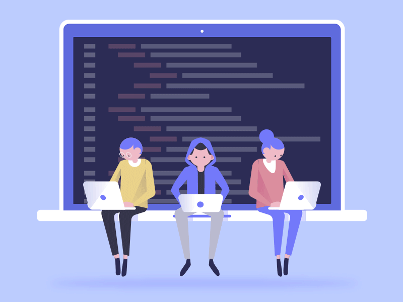

# Senior Software Engineer

Resources to prepare for senior-level software engineering interviews, internal assessments, and staff-level promotions.

---

## Topics

- [Programming Paradigms](programming-paradigms.md)
- [Communication Protocols](communication-protocols.md)
- [Performance](performance.md)
- [Architecture](architecture.md)
- [Patterns](patterns.md)
- [Code Quality](code-quality.md)
- [CI/CD](ci-cd.md)
- [SDLC](sdlc.md)
- [Estimations](estimations.md)
- [Security](security.md)
- [Soft Skills](soft-skills.md)
- [Algorithms & System Design](algorithms.md)
- [Behavioral Interview](behavioral-interview.md)
- [AI & LLMs](ai.md)
- [Blogs, Influencers & Talks](blogs-and-influencers.md)

---

## What defines a senior engineer when AI exists?

AI tools (Copilot, Claude, Cursor) can now generate code, suggest architectures, and write tests. This raises the bar — not lowers it — for what "senior" means.

What still separates senior engineers:

- **Judgment** — knowing *what* to build and *why*, not just *how*
- **Taste** — recognizing good architecture when AI produces both good and bad
- **Problem framing** — AI cannot define the right problem; humans must
- **System thinking** — reasoning about failure modes, trade-offs, scale
- **Communication** — translating technical decisions into business outcomes
- **Critical review** — catching subtle bugs and security issues in AI-generated code

> The engineers who thrive are those who use AI to amplify their judgment, not replace it.

---

## What changed in the past 3 years

This guide was originally created in 2022. The engineering landscape shifted significantly:

**AI became a primary tool.** Code generation, code review, and documentation are now AI-assisted by default. Engineers who can effectively direct AI tools while critically evaluating output have a major advantage. A new [AI & LLMs](ai.md) topic covers the foundations, tooling, and architecture patterns.

**CI/CD evolved toward GitOps and supply chain security.** GitHub Actions replaced Jenkins as the default. GitOps (ArgoCD, Flux) standardized declarative deployments. SLSA, SBOM, and Sigstore emerged as essential practices after several high-profile supply chain attacks.

**Platform engineering emerged as a discipline.** Developer experience and internal developer platforms (IDPs) became dedicated engineering investments. DORA metrics and SPACE framework gave teams ways to measure engineering performance beyond velocity.

**Security threats expanded into AI territory.** Prompt injection, OWASP LLM Top 10, and AI-specific attack vectors are now part of the security landscape alongside the classic web vulnerabilities.

**HTTP/3, gRPC, and tRPC matured.** The protocol landscape expanded. REST is no longer the default choice — teams evaluate gRPC, GraphQL, tRPC, and SSE based on use case.

**Performance shifted to Core Web Vitals.** INP replaced FID as a Core Web Vital in 2024. The web.dev platform became the canonical performance reference. Islands Architecture and React Server Components changed how SSR performance is approached.

**Staff engineering got its own literature.** Books like *Staff Engineer*, *The Staff Engineer's Path*, and *An Elegant Puzzle* defined what it means to grow beyond senior without going into management.
